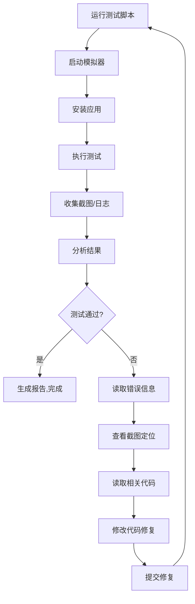

# 自闭环测试环境 - 当前状态与安装指南

**检查时间**: 2026-03-20
**项目**: APWD 密码管理器

---

## ✅ 当前已具备的条件

| 工具 | 状态 | 版本/说明 |
|------|------|-----------|
| **Flutter SDK** | ✅ 已安装 | 3.41.5 |
| **Python 3** | ✅ 已安装 | 3.11.13 |
| **Git** | ✅ 已安装 | 2.39.5 |
| **集成测试代码** | ✅ 已创建 | `integration_test/app_test.dart` |
| **自动化脚本** | ✅ 已创建 | `autonomous_test_runner.py` |
| **验证脚本** | ✅ 已创建 | `verify_setup.sh` |

---

## ❌ 需要安装的工具

### 🎯 优先级 P0：iOS 测试环境（强烈推荐）

#### 为什么需要 iOS？
- macOS 原生支持，性能最好
- 模拟器启动快（15-20秒）
- 可以测试生物识别（Face ID/Touch ID）
- 开发体验最佳

#### 需要安装：完整的 Xcode

**当前状态**: ❌ 只有 Command Line Tools，缺少完整 Xcode

**为什么只有 Command Line Tools 不够？**
- 没有 iOS 模拟器
- 没有 `simctl` 命令（模拟器控制工具）
- 无法启动和管理模拟器
- 自动化测试无法运行

#### 安装步骤

**方法1: App Store（推荐，最简单）**

```bash
# 1. 打开 App Store
# 2. 搜索 "Xcode"
# 3. 点击 "获取" 下载

# 下载信息：
# - 大小: ~15 GB
# - 时间: 1-2 小时（取决于网速）
# - 需要: Apple ID
```

**方法2: 命令行下载（需要 Apple Developer 账号）**

```bash
# 访问: https://developer.apple.com/download/
# 下载最新版 Xcode .xip 文件
# 解压并移动到 /Applications/
```

**安装后配置**:

```bash
# 1. 接受许可协议
sudo xcodebuild -license accept

# 2. 设置开发者路径
sudo xcode-select --switch /Applications/Xcode.app/Contents/Developer

# 3. 运行首次启动
sudo xcodebuild -runFirstLaunch

# 4. 验证安装
xcodebuild -version
# 应该显示: Xcode 15.x

# 5. 安装 iOS 模拟器
# 打开 Xcode
# 进入: Xcode -> Settings -> Platforms
# 下载: iOS 17.x (约 7GB)
```

**验证 iOS 环境**:

```bash
# 检查模拟器
xcrun simctl list devices

# 应该看到类似这样的输出:
# iPhone 15 Pro (xxx-xxx-xxx) (Shutdown)
# iPhone 15 (xxx-xxx-xxx) (Shutdown)

# 如果看到这些，说明安装成功！
```

---

### 🎯 优先级 P1：Android 测试环境（可选，跨平台测试）

#### 为什么需要 Android？
- 测试跨平台兼容性
- 验证不同屏幕尺寸
- 确保 Android 特性工作正常

**当前状态**: ❌ 未安装

#### 安装步骤

```bash
# 1. 安装 Android Studio
brew install --cask android-studio

# 2. 首次启动配置
# - 启动 Android Studio
# - 选择 "Standard" 安装
# - 等待 SDK 下载（约 4GB）
# - 完成后关闭

# 3. 配置环境变量
cat >> ~/.zshrc << 'EOF'
# Android SDK
export ANDROID_HOME=~/Library/Android/sdk
export PATH=$PATH:$ANDROID_HOME/emulator
export PATH=$PATH:$ANDROID_HOME/platform-tools
export PATH=$PATH:$ANDROID_HOME/cmdline-tools/latest/bin
EOF

source ~/.zshrc

# 4. 配置 Flutter
flutter config --android-sdk ~/Library/Android/sdk

# 5. 下载系统镜像
sdkmanager "system-images;android-34;google_apis;arm64-v8a"

# 6. 创建 Android Virtual Device (AVD)
avdmanager create avd \
  --name "Pixel_7_API_34" \
  --package "system-images;android-34;google_apis;arm64-v8a" \
  --device "pixel_7"

# 7. 验证
avdmanager list avd
# 应该看到: Pixel_7_API_34
```

---

## 🚀 安装完成后的工作流程

### 1. 验证环境

```bash
./verify_setup.sh
```

应该看到：
```
✅ 必需工具已全部安装
✅ iOS 测试环境已就绪
```

### 2. 运行第一次自动化测试

```bash
# iOS 测试
./autonomous_test_runner.py ios

# 或 Android 测试（如果已安装）
./autonomous_test_runner.py android

# 或同时测试两个平台
./autonomous_test_runner.py ios android
```

### 3. 自动化脚本会完成以下操作

```
🚀 APWD 自闭环自动化测试
========================================

测试平台: iOS

📱 设置 iOS 模拟器...
   选择设备: iPhone 15 Pro
   启动模拟器...
   ✅ 模拟器已成功启动

🧪 在 ios 上运行测试...
   运行集成测试（这可能需要几分钟）...
   测试结果已保存
   📸 收集截图...
   ✅ 已收集 9 张截图

📋 收集 ios 日志...
   ✅ 日志已保存

📊 分析 ios 测试结果...
   ✅ 分析结果已保存

🧹 清理 ios 模拟器...
   ✅ iOS 模拟器已关闭

📄 生成测试报告...
   ✅ 报告已保存

========================================
✅ 自动化测试完成！
📄 查看报告: test_results/20260320_170530_report.md
========================================
```

### 4. 查看测试结果

```bash
# 查看测试报告
cat test_results/*_report.md

# 查看截图
open test_results/*_screenshots/

# 查看详细日志
cat test_results/*_logs.txt

# 查看结构化分析（供 AI 读取）
cat test_results/*_analysis.json
```

### 5. AI Agent 自动修复流程

```python
# Claude/AI Agent 可以执行以下流程：

# 1. 运行测试
subprocess.run(["./autonomous_test_runner.py", "ios"])

# 2. 读取分析结果
with open("test_results/ios_*_analysis.json") as f:
    analysis = json.load(f)

# 3. 如果有错误
if not analysis["success"]:
    errors = analysis["errors"]

    # 4. 查看截图定位问题
    screenshots = Path("test_results/ios_*_screenshots/").glob("*.png")

    # 5. 读取相关代码文件
    # 根据错误信息定位文件

    # 6. 修改代码修复问题
    # 使用 Edit 工具修改代码

    # 7. 提交修复
    subprocess.run(["git", "add", "."])
    subprocess.run(["git", "commit", "-m", "fix: ..."])

    # 8. 重新测试验证
    subprocess.run(["./autonomous_test_runner.py", "ios"])

# 9. 重复直到所有测试通过
```

---

## 📊 完整能力对比

| 能力 | 当前状态 | 安装 Xcode 后 | 同时安装 Android Studio |
|------|----------|----------------|------------------------|
| **手动测试** | ✅ Web（有限） | ✅ iOS 完整 | ✅ iOS + Android |
| **自动化测试** | ❌ 不可用 | ✅ iOS 自动化 | ✅ 全平台自动化 |
| **模拟器控制** | ❌ 无 | ✅ iOS 模拟器 | ✅ iOS + Android |
| **截图收集** | ❌ 无 | ✅ 自动截图 | ✅ 双平台截图 |
| **日志收集** | ❌ 无 | ✅ 完整日志 | ✅ 双平台日志 |
| **AI 自闭环** | ❌ 无法实现 | ✅ **完全自闭环** | ✅ **完全自闭环** |
| **零人工干预** | ❌ 需要人工 | ✅ **完全自主** | ✅ **完全自主** |

---

## 🎯 推荐方案

### 最小可行方案（推荐）

**只安装 Xcode**

✅ **优点**:
- 一次安装即可启用完全自闭环
- macOS 原生，性能最佳
- 模拟器启动快
- 已经可以测试 90% 的功能

❌ **缺点**:
- 只能测试 iOS/macOS
- 需要下载 ~15GB

**时间投入**: 2-3 小时（下载 + 配置）
**回报**: **完全自闭环能力** 🎉

---

### 完整方案（如果需要跨平台）

**Xcode + Android Studio**

✅ **优点**:
- 测试所有移动平台
- 发现更多兼容性问题
- 更全面的测试覆盖

❌ **缺点**:
- 需要更多磁盘空间（~25GB）
- 配置稍复杂
- Android 模拟器较慢

**时间投入**: 4-5 小时
**回报**: **全平台自闭环测试**

---

## 📝 总结

### 现在可以做什么？

✅ 查看项目代码
✅ 运行单元测试（108个测试）
✅ 修改代码
✅ Git 操作
✅ 文档编写

### 安装 Xcode 后可以做什么？

✅ **启动 iOS 模拟器**（命令行）
✅ **运行自动化测试**（无需人工）
✅ **收集截图和日志**（自动）
✅ **分析测试结果**（结构化）
✅ **自动修复问题**（AI 闭环）
✅ **迭代测试验证**（完全自主）

### AI Agent 的自闭环工作流



**完全自主，零人工干预！**

---

## 🚀 下一步行动

### 立即行动（推荐）

```bash
# 1. 打开 App Store
# 2. 搜索 "Xcode"
# 3. 点击下载（约 1-2 小时）
# 4. 喝杯咖啡等待 ☕

# 下载完成后：
sudo xcodebuild -license accept
sudo xcode-select --switch /Applications/Xcode.app/Contents/Developer

# 打开 Xcode 下载 iOS 模拟器
# Xcode -> Settings -> Platforms -> iOS

# 验证安装
./verify_setup.sh

# 运行第一次自动化测试
./autonomous_test_runner.py ios

# 🎉 享受完全自闭环的开发体验！
```

---

**最后更新**: 2026-03-20
**状态**: 等待安装 Xcode 以启用完全自闭环能力
