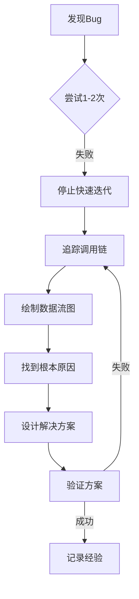

# 调试指南 (Debugging Guide)

> **目的**：记录调试过程中的经验教训，避免重复犯错，提高问题排查效率。

## 核心原则

### 🎯 症状 ≠ 原因

**错误示例**：看到崩溃发生在导航时，就认为是导航时机问题
**正确做法**：深入分析为什么导航会触发崩溃，找到根本原因

### 🔄 避免快速迭代陷阱

当同一个方向的多次尝试都失败时，**停下来，换个角度分析**。

```
❌ 错误模式：
尝试1失败 → 尝试2(同方向的微调) → 尝试3(继续微调) → ...
   ↓
陷入思维定势，在错误的方向上越走越远

✅ 正确模式：
尝试1失败 → 尝试2失败 → STOP!
   ↓
系统分析：追踪完整调用链，理解数据流向，找到根本原因
   ↓
设计正确的解决方案
```

### 📊 使用Plan Mode进行系统分析

当遇到以下情况时，立即进入Plan Mode：
- ✅ 同一个bug尝试3次以上仍未解决
- ✅ 错误信息不够直观，无法立即定位原因
- ✅ 涉及多个组件/服务的交互
- ✅ 用户反复说"还是报错"

---

## 案例研究：Provider Re-entrant Notification Bug

### 问题描述

**现象**：启用生物识别时，点击"Confirm"按钮后崩溃
**错误**：`AssertionError: _dependents.isEmpty is not true`
**位置**：`flutter/src/widgets/framework.dart:6268`

### ❌ 失败的调试过程（反面教材）

#### 尝试1：改变UI组件
```dart
// 从 SwitchListTile 改成 ListTile
// 失败原因：只是换了组件，context来源没变
```

#### 尝试2-5：各种异步延迟
```dart
// Future.microtask
// WidgetsBinding.addPostFrameCallback
// Future.delayed(Duration.zero)
// scheduleMicrotask
// 失败原因：延迟了执行，但context依赖链没打破
```

#### 尝试6：提前导航
```dart
// 在dialog关闭前先导航到home
// 失败原因：导航仍然使用Consumer的context
```

#### 尝试7：调用_loadSettings()
```dart
// 试图"刷新"Provider状态
// 失败原因：没有解决re-entrant notification的本质问题
```

**共同问题**：所有尝试都是**围绕症状打转**，都在处理"何时调用"，但真正的问题是"用哪个context"。

### ✅ 正确的调试过程

#### Step 1：停止快速迭代

在第7次尝试失败后，用户说"仔细思考下！"，这是关键信号。

#### Step 2：进入Plan Mode

派出3个探索agents：
1. **Provider状态管理分析** - 分析Consumer和Provider的关系
2. **生物识别解锁流程分析** - 追踪完整的调用链
3. **Salt存储机制分析** - 排查其他潜在问题

#### Step 3：发现根本原因

Agent 1追踪完整的widget树和context传递：

```dart
// settings_screen.dart 的调用链：
Scaffold
  └── Consumer<SettingsProvider>  ← context来源
        └── ListView
              └── ListTile(onTap: _showEnableBiometricDialog)
                    └── AlertDialog
                          └── _enableBiometric(context)  ← 使用了Consumer的context
                                └── Navigator.of(context)  ← 问题在这里！
```

**关键洞察**：
> "Context captured from Consumer widget used for navigation during disposal"
> "Navigation uses context from Consumer, causing re-entrant notification loop"

#### Step 4：设计正确的解决方案

**根本原因**：Context dependency - 导航使用了Consumer的context
**正确方案**：打破依赖 - 使用GlobalKey for Navigator

```dart
// main.dart
final GlobalKey<NavigatorState> navigatorKey = GlobalKey<NavigatorState>();

MaterialApp(
  navigatorKey: navigatorKey,
  // ...
)

// settings_screen.dart
import '../main.dart' show navigatorKey;

// 使用全局navigator key，不依赖Consumer的context
navigatorKey.currentState?.pushNamedAndRemoveUntil('/home', (route) => false);
```

### 教训总结

| 错误做法 | 为什么错 | 正确做法 |
|---------|---------|---------|
| 看到崩溃在导航，就改导航时机 | 治标不治本 | 分析为什么导航会触发崩溃 |
| 尝试各种异步方案 | 同方向反复尝试 | 追踪context来源 |
| 快速迭代、快速测试 | 陷入思维定势 | 系统分析调用链 |
| 依赖错误信息猜测 | "_dependents.isEmpty"不直观 | 深入理解Provider通知机制 |

---

## 调试方法论

### 1. 理解错误机制

不要只看错误信息，要理解**为什么框架会抛出这个错误**。

**案例**：`_dependents.isEmpty is not true`
- 不只是"有依赖"这么简单
- 是Flutter的re-entrant notification保护机制
- 意味着在通知过程中有人试图修改状态

### 2. 追踪完整调用链

使用以下工具和方法：

#### A. 代码追踪
```dart
// 在关键位置添加日志
print('[DEBUG] Context from: ${context.widget.runtimeType}');
print('[DEBUG] Navigator state: ${Navigator.of(context)}');
```

#### B. Widget树分析
```
手动绘制widget树：
- 数据从哪里来？
- context从哪里来？
- 谁依赖谁？
```

#### C. 时序分析
```
事件发生顺序：
1. 用户点击 → 2. Dialog显示 → 3. 输入密码 → 4. 点击Confirm
   ↓
5. 存储密码 → 6. 更新Provider → 7. 关闭Dialog → 8. 导航
                                                    ↓
                                         问题发生在这里！为什么？
```

### 3. 系统性问题排查步骤



### 4. 何时使用Plan Mode

**触发条件**（满足任一即启用）：
- [ ] 同一个bug尝试3次以上仍未解决
- [ ] 涉及多个服务/组件交互
- [ ] 错误堆栈跨越多个文件
- [ ] 用户反复说"还是报错"/"仔细思考"
- [ ] 错误是间歇性的，难以复现
- [ ] 需要理解整个子系统才能定位

**Plan Mode的价值**：
- ✅ 强制停止快速迭代
- ✅ 系统性分析，不漏过任何环节
- ✅ 多个agent从不同角度探索
- ✅ 产出详细的分析报告
- ✅ 设计经过验证的解决方案

---

## 常见陷阱

### 1. Context陷阱

**症状**：Widget相关的崩溃、状态不更新、导航失败

**检查清单**：
- [ ] 这个context来自哪里？
- [ ] context所属的widget还存在吗？
- [ ] 是否在异步操作后使用了过期的context？
- [ ] 是否在dispose后访问了context？

**解决方案**：
- 使用GlobalKey访问特定widget的state
- 使用BuildContext时检查mounted
- 避免在async callback中直接使用context

### 2. Provider/ChangeNotifier陷阱

**症状**：`_dependents.isEmpty`、`setState() called after dispose`

**检查清单**：
- [ ] 是否在notifyListeners()过程中触发了修改？
- [ ] 是否在dispose后调用了notifyListeners()？
- [ ] 是否在build方法中触发了Provider更新？

**解决方案**：
- 使用GlobalKey打破context依赖
- 在异步操作中检查mounted
- 合理设计状态更新时机

### 3. 异步陷阱

**症状**：`setState() called after dispose`、`Null check operator used on a null value`

**检查清单**：
- [ ] 异步操作完成时，widget还存在吗？
- [ ] 是否需要在await后检查mounted？
- [ ] 是否有未cancel的Timer/Stream？

**解决方案**：
```dart
// 在异步操作后检查mounted
await someAsyncOperation();
if (!mounted) return;
setState(() { ... });

// dispose时取消异步操作
@override
void dispose() {
  _timer?.cancel();
  _subscription?.cancel();
  super.dispose();
}
```

### 4. 时机陷阱

**症状**：数据还未准备好就被访问、初始化顺序错误

**检查清单**：
- [ ] 数据在什么时候可用？
- [ ] 访问数据的代码在什么时候执行？
- [ ] 初始化的依赖关系是否正确？

**解决方案**：
- 使用FutureBuilder/StreamBuilder处理异步数据
- 在initState中初始化，在build中使用
- 理解Widget生命周期：initState → didChangeDependencies → build

---

## 调试工具箱

### 日志技巧

```dart
// 1. 带标签的日志
print('[AUTH] Storing password...');
print('[DEBUG] Context type: ${context.widget.runtimeType}');

// 2. 带调用栈的日志（定位调用来源）
print('[DEBUG] Called from: ${StackTrace.current}');

// 3. 条件日志
assert(() {
  print('[DEBUG] Only in debug mode');
  return true;
}());

// 4. 时间戳日志（分析性能）
final sw = Stopwatch()..start();
// ... operation ...
print('[PERF] Operation took ${sw.elapsedMilliseconds}ms');
```

### Flutter DevTools

```bash
# 启动DevTools
flutter pub global activate devtools
flutter pub global run devtools

# 查看Widget树
# 查看Provider状态
# 查看性能Timeline
# 查看网络请求
```

### ADB调试

```bash
# 实时查看日志
adb logcat | grep -i "flutter\|AUTH"

# 清空日志
adb logcat -c

# 过滤特定tag
adb logcat -s flutter

# 查看崩溃堆栈
adb logcat -b crash
```

### 代码审查检查点

在提交代码前，自我审查：

```dart
// Context使用检查
- [ ] 所有的Navigator.of(context)都是安全的吗？
- [ ] 异步操作后使用context前检查了mounted吗？
- [ ] 是否在正确的生命周期阶段访问context？

// Provider使用检查
- [ ] notifyListeners()会导致re-entrant notification吗？
- [ ] 是否在build方法中修改了Provider状态？
- [ ] dispose时是否清理了所有listeners？

// 异步操作检查
- [ ] 所有async方法都处理了异常吗？
- [ ] dispose时是否cancel了Timer/Stream？
- [ ] await后是否检查了mounted？
```

---

## 记录你的发现

每次解决一个复杂bug后，在这里添加新的案例：

### 案例模板

```markdown
### 案例X：[简短描述]

**现象**：[用户看到的错误]
**错误信息**：[具体的错误堆栈]

**失败的尝试**：
1. [尝试1] - 失败原因：[为什么没用]
2. [尝试2] - 失败原因：[为什么没用]

**根本原因**：[深层次的原因分析]

**正确解决方案**：
[代码示例]

**教训**：
- [ ] [具体的教训1]
- [ ] [具体的教训2]
```

---

## 快速参考

### 遇到Bug时的检查清单

```
□ 1. 错误信息是什么？完整的堆栈是什么？
□ 2. 能稳定复现吗？复现步骤是什么？
□ 3. 最近改了什么代码？（git diff）
□ 4. 添加日志，追踪代码执行路径
□ 5. 尝试1-2次后仍未解决？
    → YES: 进入Plan Mode，系统分析
    → NO: 继续定位
□ 6. 绘制调用链和数据流图
□ 7. 找到根本原因（不是症状）
□ 8. 设计并验证解决方案
□ 9. 记录经验到本文档
```

### 何时进入Plan Mode

```
满足以下任一条件，立即进入Plan Mode：
✓ 同一bug尝试3次以上
✓ 用户说"仔细思考"/"还是报错"
✓ 涉及多个组件交互
✓ 错误信息不直观
✓ 需要理解子系统架构
```

### 避免的思维模式

```
❌ "再试一次不同的延迟时间"
❌ "可能是XX组件的问题，换一个试试"
❌ "这个错误看起来像YY，我之前见过类似的"
❌ "快速改一下，应该就好了"

✅ "停下来，理解为什么会这样"
✅ "追踪完整的调用链"
✅ "找到根本原因，不是症状"
✅ "设计正确的方案，不是workaround"
```

---

## 总结

**核心理念**：
1. **症状 ≠ 原因** - 深入分析，找到本质
2. **系统分析 > 快速迭代** - 在复杂问题面前，慢就是快
3. **使用Plan Mode** - 当快速迭代失败时，立即切换模式
4. **记录经验** - 每次解决复杂bug都是学习机会

**记住**：
> "如果你发现自己在同一个方向上尝试了3次以上还没解决，
> 不是问题太难，而是方向错了。停下来，换个角度分析。"

---

*最后更新：2026-03-21*
*维护者：开发团队*
