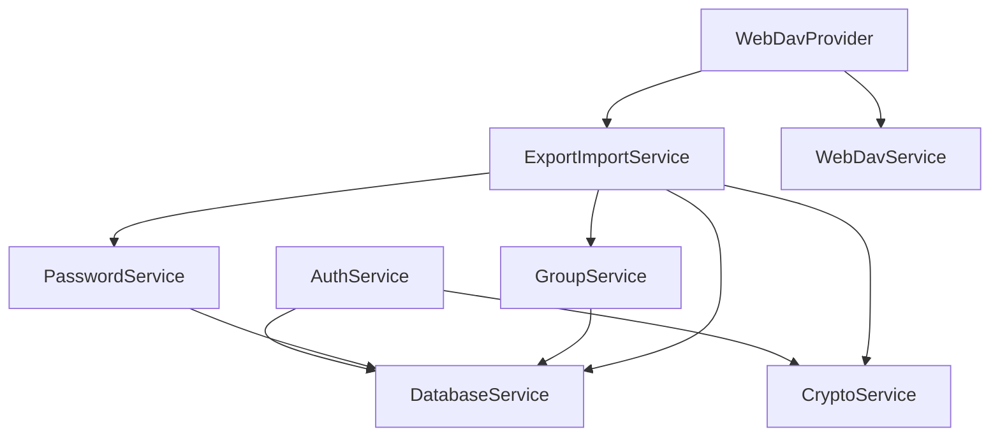

# Services Layer

Services contain all business logic. They are **stateless** and have no UI dependencies.

## Service Responsibilities

Services handle:
- ✅ Data access (database, network, files)
- ✅ Business logic and validation
- ✅ Cryptographic operations
- ✅ External API calls

Services do NOT:
- ❌ Manage UI state
- ❌ Import Flutter widgets
- ❌ Use `ChangeNotifier`
- ❌ Handle navigation

## Service Catalog

### DatabaseService
**Purpose**: SQLCipher database operations and schema management

**Key Methods:**
```dart
Future<void> initialize(String path, Uint8List key)
Future<int> insertPassword(Map<String, dynamic> data)
Future<List<Map<String, dynamic>>> queryPasswords({String? groupId})
Future<void> setIntSetting(String key, int value)
Future<int?> getIntSetting(String key)
```

**Encryption**: Database encrypted with SQLCipher (AES-256)

**Schema**:
- `passwords` table: id, group_id, title, username, password, url, notes, created_at, updated_at
- `groups` table: id, name, icon, sort_order, created_at, updated_at
- `settings` table: key, value

**Testing**: See `test/services/database_service_test.dart`

---

### CryptoService
**Purpose**: Encryption, decryption, and key derivation primitives

**Key Methods:**
```dart
Uint8List generateSalt({int length = 32})
Future<Uint8List> deriveKey(String password, Uint8List salt, {int iterations = 100000})
Uint8List getDatabaseKey(Uint8List derivedKey)  // First 32 bytes
Uint8List getValidationKey(Uint8List derivedKey)  // Last 32 bytes
String encryptText(String plaintext, Uint8List key)
String decryptText(String ciphertext, Uint8List key)
```

**Algorithms:**
- Key derivation: PBKDF2-HMAC-SHA256 (100,000 iterations)
- Encryption: AES-256-CBC with PKCS7 padding
- Random IV per encryption

**Key Structure:**
```
Master Password
      ↓ PBKDF2 (100k iterations) + Salt
Derived Key (64 bytes)
      ↓ split
├─ Database Key (32 bytes) → For SQLCipher
└─ Validation Key (32 bytes) → Verify password
```

**Security Notes:**
- Never reuse IV across encryptions
- Salt stored with encrypted data
- Keys never persisted to disk

**Testing**: See `test/services/crypto_service_test.dart`

---

### AuthService
**Purpose**: Master password management and authentication

**Key Methods:**
```dart
Future<bool> setupMasterPassword(String password)
Future<bool> verifyMasterPassword(String password)
Future<void> changeMasterPassword(String oldPassword, String newPassword)
bool get isBiometricAvailable
Future<bool> enableBiometric()
Future<bool> authenticateWithBiometric()
```

**How it works:**
1. **Setup**: Derive key from password, generate validation hash, store in database
2. **Verify**: Derive key from input, compare validation hash
3. **Biometric**: Store encrypted password in Keychain, retrieve and verify on auth

**Storage:**
- Validation data: Database (settings table)
- Biometric password: Flutter Secure Storage (encrypted by OS)
- Database key: Never stored (derived on unlock)

**Testing**: See `test/services/auth_service_test.dart`

---

### PasswordService
**Purpose**: Password entry CRUD operations

**Key Methods:**
```dart
Future<int> create(PasswordEntry entry)
Future<PasswordEntry?> getById(int id)
Future<List<PasswordEntry>> getAll()
Future<List<PasswordEntry>> getByGroupId(int groupId)
Future<bool> update(PasswordEntry entry)
Future<bool> delete(int id)
Future<List<PasswordEntry>> search(String query)
```

**Behavior:**
- All operations are transactional
- Returns null/false on failure (no exceptions)
- Search is case-insensitive across title, username, url, notes

**Testing**: See `test/services/password_service_test.dart`

---

### GroupService
**Purpose**: Password group CRUD operations

**Key Methods:**
```dart
Future<int> create(Group group)
Future<Group?> getById(int id)
Future<List<Group>> getAll()
Future<bool> update(Group group)
Future<bool> delete(int id)
```

**Behavior:**
- Groups are soft containers (no cascade delete)
- Default group (ID: 1) created on first app launch
- Deleting a group doesn't delete its passwords

**Testing**: See `test/services/group_service_test.dart`

---

### ExportImportService
**Purpose**: Encrypted backup/restore functionality

**Key Methods:**
```dart
Future<String> exportToJson(String password)
Future<void> importFromJson(String json, String password, {bool overwrite = false})
Future<void> createBackup(String filePath, String password)
Future<void> restoreBackup(String filePath, String password)
String generateBackupFileName()  // apwd_backup_YYYYMMDD_HHMMSS.apwd
Future<String> createTempBackup(String password)  // For WebDAV
```

**Export Format (.apwd file):**
```json
{
  "version": "1.0",
  "salt": "base64-encoded-salt",
  "data": "encrypted-json-payload"
}
```

**Encrypted Payload:**
```json
{
  "version": "1.0",
  "timestamp": 1234567890,
  "groups": [...],
  "passwords": [...],
  "settings": {...}
}
```

**Import Modes:**
- `overwrite: false` - Skip existing entries (match by ID)
- `overwrite: true` - Replace existing entries

**Security:**
- Export password independent of master password
- Same encryption as database (AES-256-CBC)
- Random salt per export

**Testing**: See `test/services/export_import_service_test.dart`

---

### WebDavService
**Purpose**: WebDAV protocol for remote backup

**Key Methods:**
```dart
Future<bool> testConnection(String url, String username, String password)
Future<void> connect(String url, String username, String password, {String? remotePath})
Future<void> uploadBackup(String localFilePath, String remoteFileName)
Future<String> downloadBackup(String remoteFileName, String localDirectory)
Future<List<WebDavBackupFile>> listBackups()
Future<void> deleteBackup(String remoteFileName)
```

**Features:**
- URL normalization (add https://, trailing slash)
- Progress callbacks for upload/download
- Error handling with typed exceptions

**WebDavBackupFile Model:**
```dart
class WebDavBackupFile {
  final String name;
  final int size;
  final DateTime? modifiedTime;
}
```

**Error Types:**
- `WebDavErrorType.connection` - Network issues
- `WebDavErrorType.authentication` - Invalid credentials
- `WebDavErrorType.notFound` - File doesn't exist
- `WebDavErrorType.server` - Server errors

**Testing**: See `test/services/webdav_service_test.dart`

---

### GeneratorService
**Purpose**: Secure password generation

**Key Methods:**
```dart
String generatePassword({
  int length = 16,
  bool uppercase = true,
  bool lowercase = true,
  bool numbers = true,
  bool symbols = true,
})
```

**Behavior:**
- Uses `Random.secure()` for cryptographic randomness
- Ensures at least one character from each enabled category
- Shuffles result to avoid predictable patterns

**Character Sets:**
- Uppercase: A-Z
- Lowercase: a-z
- Numbers: 0-9
- Symbols: !@#$%^&*()_+-=[]{}|;:,.<>?

---

## Service Dependencies



## Testing Services

### Unit Test Pattern

```dart
void main() {
  late ServiceName service;
  late MockDependency mockDependency;

  setUp(() {
    mockDependency = MockDependency();
    service = ServiceName(mockDependency);
  });

  tearDown(() {
    // Clean up
  });

  test('should do something', () async {
    // Arrange
    when(mockDependency.method()).thenReturn(value);

    // Act
    final result = await service.doSomething();

    // Assert
    expect(result, expectedValue);
    verify(mockDependency.method()).called(1);
  });
}
```

### Integration Test Pattern

For services with database/file I/O:

```dart
void main() {
  late DatabaseService dbService;
  late String testDbPath;

  setUp(() async {
    testDbPath = '${Directory.systemTemp.path}/test_${DateTime.now().millisecondsSinceEpoch}.db';
    dbService = DatabaseService();
    await dbService.initialize(testDbPath, testKey);
  });

  tearDown() async {
    await dbService.close();
    await File(testDbPath).delete();
  });

  test('should persist data', () async {
    // Test with real database
  });
}
```

## Common Patterns

### Error Handling

Services use exceptions for errors:

```dart
class PasswordService {
  Future<int> create(PasswordEntry entry) async {
    try {
      return await _dbService.insertPassword(entry.toMap());
    } catch (e) {
      throw PasswordServiceException('Failed to create password: $e');
    }
  }
}
```

Providers catch and handle:

```dart
class PasswordProvider extends ChangeNotifier {
  Future<bool> createPassword(PasswordEntry entry) async {
    try {
      await _passwordService.create(entry);
      return true;
    } catch (e) {
      _errorMessage = e.toString();
      return false;
    } finally {
      notifyListeners();
    }
  }
}
```

### Async Operations

All I/O operations are async:

```dart
// ✅ Good
Future<List<PasswordEntry>> getAll() async {
  final maps = await _dbService.queryPasswords();
  return maps.map((m) => PasswordEntry.fromMap(m)).toList();
}

// ❌ Bad
List<PasswordEntry> getAll() {
  // Synchronous database access blocks UI
}
```

### Dependency Injection

Services receive dependencies via constructor:

```dart
class PasswordService {
  final DatabaseService _dbService;

  PasswordService(this._dbService);

  // Use _dbService for database operations
}
```

## Adding a New Service

1. Create file in `lib/services/`
2. Define interface (public methods)
3. Inject dependencies in constructor
4. Implement business logic
5. Write unit tests in `test/services/`
6. Update this documentation

### Example: Adding NotificationService

```dart
// lib/services/notification_service.dart
class NotificationService {
  final DatabaseService _dbService;

  NotificationService(this._dbService);

  Future<void> schedulePasswordExpiry(int passwordId, DateTime expiryDate) async {
    // Implementation
  }
}

// test/services/notification_service_test.dart
void main() {
  test('should schedule notification', () async {
    // Test implementation
  });
}

// Register in main.dart
final notificationService = NotificationService(dbService);
Provider<NotificationService>.value(value: notificationService),
```

## Performance Tips

- **Batch operations**: Use database transactions for multiple inserts
- **Lazy loading**: Don't load all data upfront
- **Caching**: Cache expensive computations in providers, not services
- **Async properly**: Use `async`/`await`, never block main thread

## Security Best Practices

1. **Never log sensitive data** (passwords, keys, tokens)
2. **Clear sensitive data** from memory when done
3. **Validate input** before database operations
4. **Use parameterized queries** to prevent SQL injection
5. **Encrypt everything** at rest and in transit

## Next Steps

- See [../providers/CLAUDE.md](../providers/CLAUDE.md) for how providers use services
- See [../CLAUDE.md](../CLAUDE.md) for overall architecture
